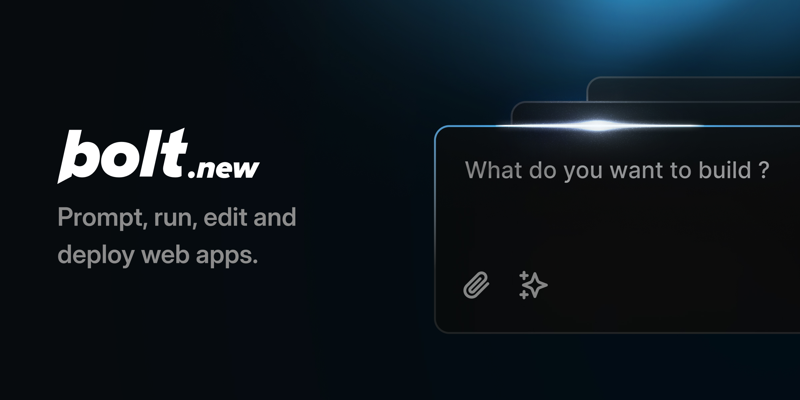

# Abalon.Click: توسعه وب فول‌استک با هوش مصنوعی در مرورگر

Abalon.Click یک ابزار توسعه وب مبتنی بر هوش مصنوعی است که به شما امکان ایجاد، اجرا، ویرایش و استقرار اپلیکیشن‌های فول‌استک را مستقیماً از مرورگر می‌دهد—بدون نیاز به تنظیمات محلی. اگر اینجا هستید تا ابزار توسعه وب مبتنی بر هوش مصنوعی خود را با استفاده از کدبیس متن‌باز Abalon.Click بسازید، [اینجا کلیک کنید تا شروع کنید!](./CONTRIBUTING.md)

## چه چیزی Abalon.Click را متفاوت می‌کند

Claude، v0 و غیره فوق‌العاده هستند - اما نمی‌توانید پکیج نصب کنید، بک‌اند اجرا کنید یا کد ویرایش کنید. اینجاست که Abalon.Click متمایز می‌شود:

- **فول‌استک در مرورگر**: Abalon.Click مدل‌های هوش مصنوعی پیشرفته را با محیط توسعه درون مرورگر که توسط **WebContainers StackBlitz** قدرت گرفته، ادغام می‌کند. این به شما امکان می‌دهد:
  - ابزارها و کتابخانه‌های npm (مانند Vite، Next.js و موارد دیگر) را نصب و اجرا کنید
  - سرورهای Node.js را اجرا کنید
  - با APIهای شخص ثالث تعامل کنید
  - از چت به محیط تولید استقرار دهید
  - کار خود را از طریق URL به اشتراک بگذارید

- **هوش مصنوعی با کنترل محیط**: برخلاف محیط‌های توسعه سنتی که هوش مصنوعی فقط می‌تواند در تولید کد کمک کند، Abalon.Click به مدل‌های هوش مصنوعی **کنترل کامل** بر کل محیط از جمله فایل سیستم، سرور node، مدیر پکیج، ترمینال و کنسول مرورگر می‌دهد. این امر ابزارهای هوش مصنوعی را قادر می‌سازد تا کل چرخه حیات اپلیکیشن را از ایجاد تا استقرار مدیریت کنند.

چه توسعه‌دهنده باتجربه، مدیر محصول یا طراح باشید، Abalon.Click به شما امکان ساخت اپلیکیشن‌های فول‌استک درجه تولید را با سهولت می‌دهد.

برای توسعه‌دهندگانی که علاقه‌مند به ساخت ابزارهای توسعه مبتنی بر هوش مصنوعی خود با WebContainers هستند، کدبیس متن‌باز Abalon.Click را در این مخزن بررسی کنید!

## نکات و ترفندها

در اینجا چند نکته برای بهره‌گیری بهتر از Abalon.Click آورده شده:

- **در مورد استک خود مشخص باشید**: اگر می‌خواهید از فریمورک‌ها یا کتابخانه‌های خاص (مانند Astro، Tailwind، ShadCN یا هر فریمورک محبوب JavaScript دیگر) استفاده کنید، آن‌ها را در پرامپت اولیه خود ذکر کنید تا اطمینان حاصل کنید که Abalon.Click پروژه را بر اساس آن‌ها راه‌اندازی می‌کند.

- **از آیکون بهبود پرامپت استفاده کنید**: قبل از ارسال پرامپت، سعی کنید روی آیکون 'بهبود' کلیک کنید تا مدل هوش مصنوعی به شما کمک کند پرامپت خود را بهبود دهید، سپس نتایج را قبل از ارسال ویرایش کنید.

- **ابتدا اصول اولیه را راه‌اندازی کنید، سپس ویژگی‌ها را اضافه کنید**: مطمئن شوید که ساختار اساسی اپلیکیشن شما قبل از پرداختن به عملکردهای پیشرفته‌تر در جای خود قرار گرفته است. این به Abalon.Click کمک می‌کند تا پایه پروژه شما را درک کند و اطمینان حاصل کند که همه چیز قبل از ساخت عملکردهای پیشرفته‌تر به درستی متصل شده است.

- **دستورالعمل‌های ساده را دسته‌بندی کنید**: با ترکیب دستورالعمل‌های ساده در یک پیام، وقت صرفه‌جویی کنید. به عنوان مثال، می‌توانید از Abalon.Click بخواهید که طرح رنگ را تغییر دهد، واکنش‌پذیری موبایل را اضافه کند و سرور dev را مجدداً راه‌اندازی کند، همه در یک بار که باعث صرفه‌جویی در وقت و کاهش قابل توجه مصرف اعتبار API می‌شود.

## سوالات متداول

**کجا برای طرح پولی ثبت‌نام کنم؟**  
Abalon.Click برای شروع رایگان است. اگر به توکن‌های هوش مصنوعی بیشتر یا پروژه‌های خصوصی نیاز دارید، می‌توانید اشتراک پولی را در تنظیمات [Abalon.Click](https://abalon.click) خود، در گوشه پایین سمت چپ اپلیکیشن خریداری کنید.

**اگر به حد استفاده رایگان برسم چه اتفاقی می‌افتد؟**  
پس از رسیدن به حد روزانه توکن رایگان، تعاملات هوش مصنوعی تا روز بعد یا تا زمانی که طرح خود را ارتقا دهید متوقف می‌شود.

**آیا Abalon.Click در حالت بتا است؟**  
بله، Abalon.Click در حالت بتا است و ما به طور فعال بر اساس بازخوردها آن را بهبود می‌دهیم.

**چگونه می‌توانم مشکلات Abalon.Click را گزارش کنم؟**  
بخش [Issues](https://github.com/stackblitz/abalon.click/issues) را بررسی کنید تا مشکل را گزارش دهید یا ویژگی جدیدی درخواست کنید. لطفاً از ویژگی جستجو استفاده کنید تا بررسی کنید آیا شخص دیگری همان مشکل/درخواست را ارسال کرده است یا نه.

**چه فریمورک‌ها/کتابخانه‌هایی در حال حاضر روی Abalon.Click کار می‌کنند؟**  
Abalon.Click از اکثر فریمورک‌ها و کتابخانه‌های محبوب JavaScript پشتیبانی می‌کند. اگر روی StackBlitz اجرا شود، روی Abalon.Click نیز اجرا خواهد شد.

**چگونه می‌توانم مطمئن شوم که فریمورک/پروژه من در Abalon.Click به خوبی کار می‌کند؟**  
ما مشتاق همکاری با اکوسیستم JavaScript برای بهبود عملکرد در Abalon.Click هستیم. از طریق [hello@stackblitz.com](mailto:hello@stackblitz.com) با ما تماس بگیرید تا در مورد نحوه شراکت صحبت کنیم!